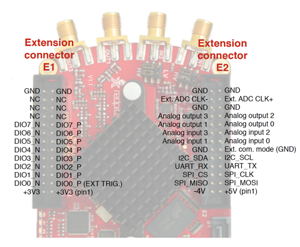
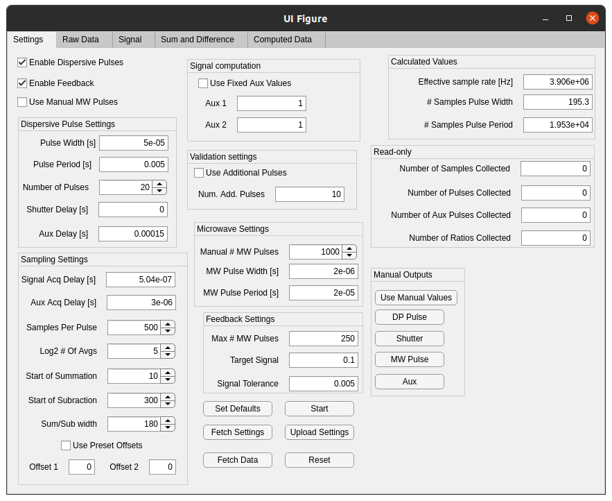

# Number stabilisation through Faraday Rotation

In ultracold atomic physics experiments, the number of atoms in a sample of atoms at a given temperature typically fluctuates between cycles of the experiment.  At best, this increases the amount of data that needs to be acquired to reach a given level of precision in measuring physical quantities.  At worst, fluctuations obscure interesting and/or important physics.  [Previous work by the group of J. Arlt in Denmark](https://link.aps.org/doi/10.1103/PhysRevLett.117.073604) has used dark-field Faraday imaging to non-destructively measure the number of atoms in a sample and then stabilise that number to below the shot-noise limit.  While impressive, it requires an expensive camera to make these measurements, and the use of the camera means that it can only make a measurement every 7 ms.  

[In our work](https://arxiv.org/abs/2102.01773), we have replaced the camera with a pair of avalanche photo-detectors (APDs) to simplify the setup and reduce the cycle time between measurements, which allows us to use an iterative scheme for stabilising the number of atoms.  Setup details can be found in the previous link, but, in short, we use a Red Pitaya FPGA development board to record the voltages produced by the APDs and convert them on-the-fly to a weighted ratio that is insensitive to changes in optical power or APD gain.  This ratio is then proportional to the number of atoms in the sample.

This repository consists of the VHDL source code, as well as a TCL script, for building the FPGA architecture which acquires and processes the APD signals, pulses on the microwave control, and handles the feedback algorithm.  To make it easier to use, a suite of MATLAB classes has been developed that allows for control of the FPGA, and much of this control can be handled via a MATLAB GUI.  Communication between MATLAB and the FPGA is done through the TCP/IP protocol with a Python-based socket server running on the Red Pitaya.  Through this combination of MATLAB and Python, parameters related to the acquisition and feedback can be set, and data from the FPGA can retrieved.

# Setting up the system

The outputs from whatever photodetectors that are used should be connected to the ADC inputs using the SMA connectors on the board.  Depending on the expected voltage level you should set the jumpers to either LV (+/- 1 V) or HV (+/- 20 V).  Control of pulses is done via the expansion header "E1" which is the header next to the SMA connector labelled "OUT2".  Below is a pinout diagram, also found [at the Red Pitaya website](https://redpitaya.readthedocs.io/en/latest/developerGuide/125-14/extent.html).  



Pins with the suffix P are outputs in this design, and pins with suffix N are inputs.  Connect input DIO0_N (on the linked diagram) to the external start trigger.  Connect output pins as follows
  - DIO0_P: "signal" pulse out. I used this for the dispersive probing laser AOM
  - DIO1_P: shutter signal out.  Connect this to a shutter driver (if using)
  - DIO2_P: microwave pulse out.  Connect to an appropriate microwave switch
  - DIO4_P: "auxiliary" pulse out. I connected this to the repump AOM via an external OR gate with the signal coming from the imaging controller FPGA.
  
With the connections done, you need to make sure that the FPGA has the write configuration.  Make sure that the Red Pitaya is connected to the lab network, and then connect to it using SSH (via PuTTY on Windows).  The address is rp-{MAC}.local or rp-{MAC}.px.otago.ac.nz where {MAC} is the last 6 hexadecimal characters in the Red Pitaya's MAC address.  It's written on the ethernet connector on the board.  User name is "root" and password is also "root".  Navigate to correct folder (should be obvious) and then load the configuration by running
```
cat system_wrapper.bit > /dev/xdevcfg
```
Once that is done, spin up the [Python socket server](#communication-with-a-remote-computer) using
```
python3 appserver.py
```
You can stop the server by using a keyboard interrupt Cntrl-C.  

To get the MATLAB graphical user interface running, make sure that you are in the "software" folder and then run the following commands in the command line
```
fb = DPFeedback;  %Creates a DPFeedback object in your workspace
fb.setDefaults(); %Sets the default values so that the GUI doesn't throw an error on missing values
AppFeedbackDP(fb);%Creates the GUI
```

If you want to skip to using the GUI without reading about the FPGA architecture and other software, click [here](#control-via-matlab) to read about the MATLAB classes used for control or [here](#matlab-graphical-user-interface) for the description of the graphical user interface.

# Overview of FPGA behaviour

The Red Pitaya (RP) expects to have its ADCs connected to the APDs measuring the ouput signals of the polarimeter.  Furthermore, the RP needs to have a rising-edge trigger signal connected to the first pin on the `ext_i` bus, and the output pulse signals associated with lasers L and L' (the so-called 'signal' and 'auxiliary' lines) need to be connected to their respective AOMs.  A shutter output signal is also available if needed.  Finally, there is a microwave output signal that needs to be connected to an appropriate microwave switch.

## Signal acquisition and computation

When the RP receives a rising-edge trigger signal, it immediately triggers the pulse generators (`PulseGen.vhd`) on the signal and auxiliary lines.  These pulse generators have a variable, 32-bit delay counter that allows the auxiliary pulse to be delayed relative to the signal pulse.  The pulses have a user-defined period (32 bits) and pulse width (16 bits), with a programmable number of pulses (16 bits).  These pulse signals are routed to both the output signals to control the AOMs as well as to the next module, `QuickAvg.vhd`.

The `QuickAvg.vhd` module performs a quick, sliding, non-overlapping average of the input ADC signals with the number of samples to average being a power of 2.  The user can set the exponent to essentially downsample the data by more or less points.  On the rising edge of the pulse signal, the module first waits for a programmable delay (14 bits) before starting the averaging process.  This delay is used to account for the non-zero propagation delay of signals from the RP to the associated physical control boxes, as well as the finite travel time of the acoustic waves through the AOMs.  The signal and auxiliary lines can have different delays.  The `QuickAvg` module sums up 2^N points, where N is a 4 bit integer, and then divides by 2^N by shifting the sum N bits to the right.  This occurs for a fixed number of samples (user programmable with 14 bits) before the process stops and waits for the next pulse.  Once the data has been averaged, it is presented on the output data port of the module along with a one clock-cycle active-high valid signal.  For debugging purposes, the first 4096 averaged values on each channel are saved to a block RAM for later retrieval.

The averaged signal is then passed to the `IntegrateADCData.vhd` module which sums the averaged data two windows before subtracting these two sums.  The first summation region should occur when light is present on the APD, and the second summation region should occur when there is no light.  The difference between these then allows for a measure of the signal relative to a possibly changing baseline voltage on the RP.  The regions of summation and subtraction are specified by 11-bit starting points `sumStart` and `subStart`, respectively, with an 10 bit width `width` that is common between them.  The width is common so that one does not need to implement division to ensure that the scales of the summation and subtraction regions are the same.  Once the subtraction has occurred, this data is presented on the output of the module with a single clock-cycle active-high valid signal.  Like the averaged data, the integrated data is also saved in a block RAM for later retrieval.

The integrated data on both the signal and auxiliary lines are then fed into the module `ComputeSignal.vhd` which waits until it gets valid signals from both the signal and auxiliary lines and then proceeds to compute the signal R (as in Eq. 4 in the arXiv paper).  This involves two multiplications and one division, and has a latency of nearly 100 clock cycles.  The ratio value R is computed to 16 bits of precision, and is presented on the output along with a valid signal.  R is saved in a block memory for later retrieval.

## Feedback

The `NumberStabilisation.vhd` controls the signals necessary for stabilising the number of atoms.  Input registers carry the target ratio (24 bits), the tolerance value below which feeback stops (24 bits), and the maximum number of microwave pulses (16 bits).  In addition, the microwave pulse width (16 bits) and period (32 bits) are set along with a manual number of microwave pulses (16 bits) for testing purposes.

This takes in the current ratio value and a one clock-cycle active-high valid signal. When feedback is enabled (input using the `cntrl_i.enable` port), the module computes the number of microwave pulses to output using the target ratio and the current ratio as well as the maximum number of pulses.  Feedback is attempted until the current ratio value is less than the tolerance.

# Communication between FPGA and operating system

## Hardware description

Communication between the FPGA and the Linux operating system is done through a memory-mapped AXI bus.  Available addresses range from 0x40000000 to 0x4FFFFFFF.  In reality, the AXI bus is far too complicated for the use to which it is put in this device, so we use a Xilinx AXI protocol converter to convert the AXI4 bus to an AXI4-Lite bus.  Even this is, for the most part, too complicated for what we need, so a special module called `AXI_Parse.vhd` converts the AXI4-Lite bus into a 5 signal interface with output signals `addr_o`, `dataValid_o`, and `writeData_o`, and input signals `readData_i` and `resp_i`.  The `addr_o` signal indicates the address that the OS is trying to access, relative to the starting address of 0x40000000.  `dataValid_o` is a two-bit signal where bit 0 is high for one clock cycle when `writeData_o` (the data from the OS) and `addr_o` are valid, and bit 1 indicates if it is a write operation (low) or a read operation (high).  The `readData_i` signal is the data being sent to the OS, and `resp_i` is a two-bit signal where bit 0 indicates that the transaction has completed and that `readData_i` is valid in the case of a read operation, and bit 1 is high only when an error has occurred.  Currently, errors occur only when an address is accessed that is not implemented in the main parsing process in `topmod.vhd`.

To simplify the code and improve code maintenance, many of the AXI related signals and processes are packaged up in the `AXI_Bus_Package.vhd` package.  This package defines the data types `t_axi_bus_master` and `t_axi_bus_slave` which can be combined into the bus type `t_axi_bus`.  The master and slave buses are used as inputs and outputs to overloaded `rw` processes which are used for handling the reading and writing of various parameter registers in the project, uniformly implemented as 32-bit `std_logic_vector` types as the sub-type `t_param_reg` (in packaged `CustomDataTypes.vhd`).

Parameter parsing is handled in the process `Parse` in the module `topmod.vhd`. This is a finite state machine with 3 states (aside from the reset state): `idle`, `processing`, and `finishing`.  When in `idle`, it waits for a AXI bus to signal that new data is available/requested.  It then moves to processing, which is a large `case` statement that sorts through different addresses to read from/write to different parameters, or read from one of the block RAMs used for storing data.  When done, it moves to the `finishing` state where it sets all single clock-cycle triggers to zero and then moves back to the `idle` state.

One will note that addresses must be aligned with 4-byte boundaries, as the AXI interface assumes that 32 bits of data will be written/read at all times.  One can get around this if necessary, but it was not implemented and thus all data written to the FPGA must be 32 bits wide and addresses used for accessing memory locations in the FPGA must also be aligned with 4-byte word boundaries; i.e., the address must end in either 0, 4, 8, or C.

## Software description

Low-level communication with the FPGA is handled by programs written in C.  For dealing with simple parameters where we only need relatively slow read/write speeds, we use the `monitor` program that is packaged with the Red Pitaya OS.  This allows for a very simple writing to and reading from the FPGA.  One invokves it thusly
```
monitor <addr> <data>
```
where `<addr>` is the memory address to access specified as an unsigned integer, and `<data>` is the data to write, also as an unsigned integer.  If data is absent, it is considered a read operation and the current value at the specified `<addr>` is printed to the command line.  Both `<addr>` and `<data>` can be specified in hexadecimal format like so
```
monitor 0x40000000
monitor 0x40000004 0x54
```
where the first line reads from memory address `0x40000000` and the second line writes the data `0x54` to memory address `0x40000004`.  

When reading from the block RAMs we want to read a lot of data in a short amount of time.  In this case we use a custom function `fetchData` (source `fetchData.c`) to read data from the FPGA.  This program uses two arguments: the number of samples to fetch and the RAM to fetch from.  The maximum number of samples to fetch is 16384.  The `fetchType` parameter, which is the second argument, has possible values [0,4] in integer steps, with 0 and 1 fetching raw data from the signal and auxiliary lines, respectively; values 2 and 3 fetching integrated data from the signal and auxiliary lines, respectively; and value 4 fetching the computed ratio.  The raw data is 16 bits internally in the FPGA so the two channels are concatenated into a single 32 bit data word.  The integrated data is 24 bits wide, so the two channels are interleaved as separate addresses in the block RAMs and retrieved as such.  The ratio data is 16 bits wide and thus is stored as one entry per address.

## Communication with a remote computer

While the FPGA can be controlled via the command line while logged into the Red Pitaya using a shell or equivalent program such as PuTTY, it can be useful to control the device from a remote computer using a scripting language that has in-built data analysis and visualization capabilities such as Python or MATLAB.  To that end, a socket server has been implemented in Python that can read/write parameters to the device and fetch data.  The server can be started using the command
```
python3 appserver.py
```
and it will start the socket server by determining the IP address using the `get_ip.sh` shell script, which looks for an IP address starting with '172.22' as is appropriate for the lab.  The socket server is started on port 6666.  

The server works via the class `Message` defined in `libserver.py` which handles reading and writing of data to and from the TCP/IP connection, and calls the `appcontroller.py` package to communicate with the FPGA.  The server expects messages to consist of a 'proto-header', a header, and a message body.  The proto-header is 2 bytes long and tells the server how long, in bytes, the header that follows is.  The header is a JSON-formatted ASCII string which has variable fields, one of which must be 'length'.  The 'length' field tells the server how long the message body is, in bytes.  The other allowed fields for the header are 'mode', 'numFetch', and 'fetchType'.  The allowed values for 'mode' are 'write', for writing parameters; 'read', for reading parameters; and 'fetch data', for reading data from the block RAMs.  Parameters must be 4 byte values when being written, and are returned as 4 byte values.  When 'mode' is 'fetch data', the fields 'numFetch' and 'fetchType' must be populated with the number of samples to fetch from memory and the memory to access, respectively.  The allowed values for 'fetchType' are given in the previous section.

Data is sent back to the client in the same form as it is received; namely, there is a 2 byte proto-header indicating the length of the following header information, followed by a message body.  The header has fields 'err', which is Boolean value indicating if there was an error; 'errMsg', which gives information about the error; and 'length', which is the length, in bytes, of the message body.  

# Control via MATLAB

A set of MATLAB classes exist to control the FPGA in addition to a MATLAB graphical user interface (GUI) for dealing with these classes.  There are four classes used for controlling the feedback design

  - `DPFeedback`
  - `DPFeedbackRegister`
  - `DPFeedbackParameter`
  - `DPFeedbackClient`

The main class, which should be instantiated in the MATLAB workspace, is `DPFeedback`.  All parameters needed for the FPGA are contained inside the `DPFeedback` class as properties of type `DPFeedbackParameter`; however, since we read and write 32-bit *registers* to the FPGA, we also have the `DPFeedbackRegister` class.  Finally, communication with the Python socket server on the Red Pitaya is handled by the `DPFeedbackClient` class which is instantiated as the property `DPFeedback.conn`.  

## DPFeedbackRegister class

The `DPFeedbackRegister` class has only three properties: `addr`, `value`, and the protected property `conn`.  The property `addr` is the memory address, relative to the offset address 0x40000000, of this particular register.  It is an unsigned 32 bit integer.  The property `value` is the 32-bit unsigned integer value that is the current value of the register.  Finally, `conn` is the `DPFeedbackClient` object representing the connection with the socket server, and is the same object as the `conn` property in `DPFeedback`.  

`DPFeedbackRegister` has four important methods: `set`, `get`, `write`, and `read`:
  - `set(v,bits)` sets the `value` property in bit range `bits` to the value of `v`.  `bits` is zero-indexed, so the least-significant bit is bit 0 and the most significant bit is bit 31.  This is used to set particular bit ranges, corresponding to a particular parameter, to the desired value
  - `get(bits)` gets the value, as an unsigned 32 bit integer, of the bit range `bits` from the property `value`.  This is used to retrieve a particular parameter form the register.
  - `write()` writes the current value of the register to the device via the socket connection `conn`.
  - `read()` reads the current value of the register from the device via the socket connection `conn`.

## DPFeedbackParameter class

The way that parameters are implemented in the design is that we write to 32 bit registers and then parameters are extracted from those registers.  Some parameters can be fully extracted from a single register, but others span multiple registers.  The `DPFeedbackParameter` class exists as the main method by which parameter values should be changed as it handles all the necessary manipulation of register values to ensure that parameters are changed in the correct way without overwriting other data.

The basic idea behind the `DPFeedbackParameter` class is that we have two related values for each parameter: the physical value, which corresponds to real-world units and describes things like time delays in seconds or voltages in volts, and the integer value, which is a representation of the physical value in a way that is easy to work with in programmable logic.  The physical value can have upper and lower limits, and there are well-defined conversions between the physical and integer values.  Additionally, the parameter spans certain bit ranges inside registers, and we need to represent those, too.

The limits for the parameter can be set using the `setLimits('lower',lowerLimit,'upper',upperLimit)` method where `lowerLimit` and `upperLimit` are the lower and upper limits.  The integer conversion functions can be set using the `setFunctions('to',toFunction,'upper',upperFunction)` with `toFunction` the function handle converting from the physical value to the integer value, and the 'fromFunction' is the function handle converting from the integer value to the physical value.

The current parameter value can be set using the `set(value)` method where `value` is the physical value to set.  This method handles the conversion to integer and writes this integer value to the relevant `DPFeedbackRegister`.  Call `write()` afterwards to write the value to the FPGA via the socket server.  Since the `set` method returns the current object, you can chain the calls together as `set(value).write()`.

The current value of the parameter can be retrieved from the FPGA using the `read()` method.  This reads the relevant registers from the FPGA, and then extracts the current integer value from those registers and stores it in the instance of `DPFeedbackParameter`.  Use the `get()` method to retrieve the physical value.


## DPFeedback

This is the main feedback-related class and contains within it instances of the previously mentioned classes.  In addition to properties related to the parameters that can be set on the device, there are properties related to the data that can be retrieved from the device.  Users should look at the definition of `DPFeedback` for an exhaustive list of device parameters.  The important data properties are
  - `signal`
  - `aux`
  - `ratio`
  - `t`
where `signal` and `aux` are instances of `DPFeedbackData` which has properties `rawX`, `rawY`, and `tSample`, which are for the raw, unprocessed data, and `data` and `t` for the processed (integrated) data.  The property `ratio` is the ratio value, and `t` is the time vector associated with `ratio`.

Important methods for the device are `upload()`, `fetch()`, `getRaw()`, `getProcessed()`, and `getRatio()`.  `upload()` uploads all current register values to the device, while `fetch()` retrieves all register values and converts them into parameter values.  `getRaw()` retrieves the raw ADC data from the device for both the signal and auxiliary lines.  `getProcessed()` retrieves the processed data for both signal and auxiliary lines, while `getRatio` retrieves the calculated ratio value from the device.

# MATLAB Graphical User Interface

A graphical user interface (GUI) was made to faciliate using the MATLAB classes.  I suggest invoking it by using the commands
```
fb = DPFeedback;  %Creates a DPFeedback object in your workspace
fb.setDefaults(); %Sets the default values so that the GUI doesn't throw an error on missing values
AppFeedbackDP(fb);%Creates the GUI
```


The above image shows how the GUI looks when on the settings tab, and the parameters are those that were used for feedback.  Other tabs (accessed at the top of the GUI) show the raw data, the processed data, and the ratio data.  Parameters can be entered in the relevant text fields, and the dispersive pulses, feedback, and/or manual microwvae pulses can be enabled/disabled using the checkboxes.  **Do not** use the "Signal Computation" settings as that was for a previous version of the feedback system and those functions are deprecated.  They have not been removed because of possible compatibility issues between difference MATLAB versions of their GUI editor.

Once settings have been input, they can be uploaded to the device by clicking on the "Upload" button.  Similarly, current device settings can be retrieved using the "Fetch" button.  Data can be retrieved using the "Fetch Data" button; the device can be reset using "Reset"; and a start trigger can be sent using "Start".  

Signals can be controlled manually by toggling the "Use Manual Values" button and then toggling the buttons below that one.  "Signal" turns the signal pulse output on/off; similarly for "Shutter", "MW Pulse", and "Aux".

Below is a description of various parameters and how to set them.

## Dispersive Pulse Settings

  - *Pulse width*: the width of the signal and auxiliary pulses in seconds.  This obviously needs to be less than the next parameter, *pulse width*.
  - *Pulse period*: the spacing between subsequent signal (and auxiliary) pulses in seconds.
  - *Number of pulses*: The number of pulses to output.  When feedback is disabled, all pulses are generated.  When feedback is enabled, fewer pulses may be generated if feedback terminates the pulse sequence.  Up to 65535 pulses can be generated.
  - *Shutter delay*: the delay, in seconds, between the receipt of the start trigger and when rising edge of the first signal pulse.  The shutter output signal goes high immediately on receipt of the start trigger, whether software generated or external.  If you aren't using the shutter then you should set this to 0
  - *Aux delay*: the delay, in seconds, between the receipt of the start trigger and the rising edge of the first auxiliary pulse.  This needs to be different than the shutter delay so that signal and auxiliary pulses are interleaved in time.  

## Sampling Settings
  - *Signal Acq Delay*: Delay, in seconds, between the rising edge of the signal pulse and when data starts to be acquired for the signal line.  This is needed to account for propagation delays between the Red Pitaya and when the optical signal actually changes.  Use this to reduce the number of samples per pulse to acquire.
  - *Aux Acq Delay*: Delay, in seconds, between the rising edge of the auxiliary pulse and when the data starts to be acquired for the auxiliary line.  This may be different than the signal acquisition delay (above).
  - *Samples per pulse*: The number of samples to acquire for each pulse, expressed after the quick averaging module.  If you look at the raw data after acquiring data, this will be the length of each pulse record.
  - *Log2 # Of Avgs*: The logarithm (base 2) of the number of averages for the quick averaging module.  Decreases the effective sampling rate and this is reflected in *Effective sampling rate* display on the top-right of the GUI.  Values of 3-4 are usually a pretty good bet.
  - *Start of summation*: the sample at which summation (integration) of the data should start.
  - *Start of subtraction*: the sample at which subtraction of the background value should start.
  - *Sum/Sub width*: the width of the summation and subtraction regions.  The regions have to be non-overlapping, and `subStart + width` has to be less than the number of samples per pulse.  This width should encompass where the measured voltage from the optical signal is mostly flat.  When these parameters are set, and you have raw data to display on the "Raw Data" tab, these regions will be displayed as thick black dashed lines, and you can adjust them as necessary to get the right summation and subtraction ranges.
  - *Use Preset Offsets*: Enable to only calculate the sum, and then subtract the preset offsets from the summed data.  This may be useful if you want to acquire data very fast, since the summation *and* subtraction takes about twice as long as just integrating over the region with signal.  Technically, for a stable offset this will be less noisy by a factor of sqrt(2).  I have not tried this yet, and for feedback I recommend leaving preset offests disabled.
  - *Offset 1/Offset 2*: the preset offsets to use.

## Microwave Settings
  - *Manual # MW Pulses*: If the checkbox *Enable Manual MW Pulses* is enabled on the top-left of the GUI, this tells the device how many microwave pulses to generate.  Up to 65535 microwave pulses.  Use this to determine the fraction of atoms that each microwave pulse removes (on average).
  - *Microwave Pulse Width*: The width, in seconds, of each microwave pulse.  2 us seems to be a good value.
  - *Microwave Pulse Period*: The period, in seconds, of the microwave pulse train.  10 us to 20 us seems to work well, although the fraction of atoms removed is not particularly sensitive to the period.

## Feedback Settings
  - *Max # MW Pulses*: The maximum number of microwave pulses to apply, equivalent to bf^{-1} in the paper.  Keep in mind that when feedback is enabled, the dispsersive pulse period has to be longer than the maximum number of microwave pulses times the microwave pulse period, because otherwise the microwaves won't finish before the next probe pulse.
  - *Target Signal*: The target ratio value for feedback.  While the ratio signal that is returned may be a negative, this target value is always positive and the FPGA calculates the absolute value of the ratio value before using it for feedback.
  - *Signal Tolerance*: The tolerance value for feedback, which is defined as the value `tol` where feedback terminates if the current ratio `R` is `R < (1 + tol)*R_{target}`.  **Note** that when setting this value sometimes it gets screwed up.  Check that it set correctly by uploading then fetching parameters using the "Upload" and "Fetch" buttons and making sure that the returned value is close (within the precision of the device) to the value you set.

## Calculated Values
  - *Effective Sampling Rate*: Display only, shows the effective sampling rate in Hz after quick averaging.
  - *# Samples Pulse Width*: Display only, shows the number of samples that the signal should be on for.
  - *# Samples Pulse Period*: Display only, shows the number of samples that a signal period occupies.

## Read-only
These displays show the number of samples, pulses, auxiliary pulses, and ratios collected.